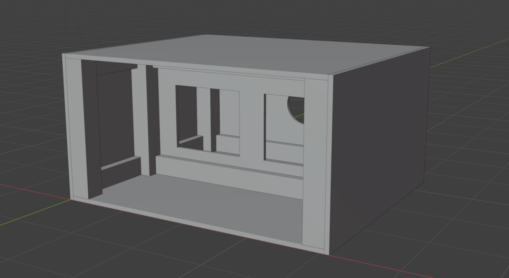

# Laminar Flow Cabinet
This includes a 3D design file created in Blender (`.blend` format) and parts list to construct a laminar flow cabinet from wood materials.
The flow direction is horizontal, meaning the cabinet has a relatively large horizontal profile, but a not very large vertical profile.
Currently this is a WIP, but the project is posted here for documentation.

## Dimensions
The cabinet has two chambers. The back chamber for air filtration, and the front chamber for work.
Each chamber is roughly four feet wide and two feet tall;
however, the depth is split in half for the two compartments.

Final working area dimensions:
 - 48" wide
 - 24" high
 - 20" deep

Final exterior dimensions:
 - 48" wide
 - 25.5" high
 - 41.5" deep

## Parts List
Here's the list of parts needed to purchase. 
Most parts should be obtainable at a hardware store, but some parts might not be.

### Final Tally
Here's the final parts list to pickup at a hardware store
 - 2x 4'-by-8' 0.75" ABX plywood sheets
 - 2x 10' 4x4 boards
 - 5x 92.5" (or 8') 2x4 boards
 - 1x tube of liquid nails wood bonding material (for airtight seals)
 - 1x sheet of 24"x48" acrylic for a front sliding cover

These parts might be obtainable at a hardware store, or might need to be purchased elsewhere
 - 2x HEPA filters (roughly 12" square)
 - 2x small grips (3d printable) for lifting the acrylic sheet
 - 1x (adjustable) fan

### Details
This is the breakdown of the exact cuts and how the parts list came to be. This may be important for assembling the cabinet.

3/4" ABX Plywood:
 - 2x 48"-by-41.5" 0.75" ABX plywood (top and bottom)
 - 2x 41.5"-by-25.5" 0.75" ABX plywood (left and right)
 - 2x 48"-by-24" 0.75" ABX plywood (interior wall and rear wall)
This can be cut from 2x 4'x8' sheets -- cut each 4'-by-8' sheet to 41.5", 24", and 25.5" length pieces, with 5" to spare

4x4 boards:
 - 8x 24" 4x4 boards (four supports in front compartment, four supports in rear compartment)
This can be cut from 2x 10' 4x4 boards (don't recommend 8' since saw blade removes too much material; approx 1/8" lost per cut)

2x4 boards:
 - 6x 41" 2x4 boards (two horizontal runners in front compartment, 4 horizontal runners in rear compartment)
 - 4x 13" 2x4 boards (four depth runners in rear compartment)
 - (optional) 4x 13" 2x4 boards (four depth runners in front compartment)

It is possible to cut horizontal runners using 92.5" 2x4 boards, with a small margin of 0.5" for errors.
3x 92.5" 2x4 boards (or 8' boards) for horizontal runners
2x 92.5" 2x4 boards (or 8' boards) for depth runners

Two HEPA filters placed in the center of the dividing wall, inside the rear compartment.

One adjustable speed fan (adjustable is important for tuning the flow properly) placed in the center of the rear wall, inside the rear compartment.

## Fan Specs
The majority of laminar flow hoods utilize a flow rate of around 0.5 m/s, or 1.64 ft/s,
so we will pick a fan based on this flow rate.
The 2x HEPA filters I chose were 13.5"-by-11.5", resulting in 2.15 ft^2 of area.
Therefore, the overall flow rate of the fan should be 3.537 ft^3/s, or 212.2 ft^3/min.
For the particular company I'm looking at
 - 8" fan is rated for 428 ft^3/min
 - 6" fan is rated for 265 ft^3/min
 - 4" fan is rated for 106 ft^3/min

This means the most appropriate choice is likely the 6" fan.
If it operates at the full capacity of 265 ft^3/min (assuming no air leaks),
that's a flow rate of 2.04 ft/s, or 0.62 m/s.

Additionally, the size of the two HEPA filters imposes an optimal size on the acrylic viewing window.
The exit is 41" wide, so 2.15 ft^2 would require the glass to close at a height of 7.57" in order to have an equal cross-sectional area.
This will help guarantee the flow is laminar and therefore least likely to experience contamination.
